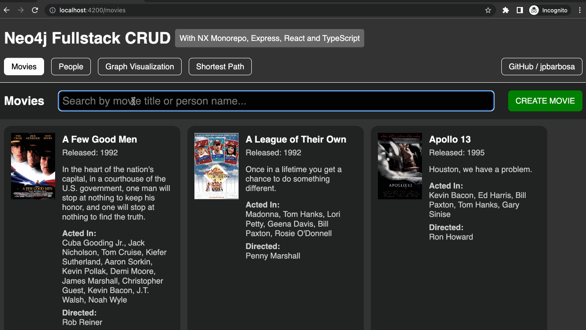

# Neo4j Fullstack CRUD

A fullstack CRUD application with Neo4j, Express, React, and TypeScript, built on top of NX monorepo structure.

### Step-By-Step Tutorial (build your own app)

https://github.com/jpbarbosa/neo4j-crud/wiki

### Run Neo4j

```bash
docker run \
    --env=NEO4J_AUTH=none \
    --env=NEO4J_apoc_export_file_enabled=true \
    --env=NEO4J_apoc_import_file_enabled=true \
    --env=NEO4J_apoc_import_file_use__neo4j__config=true \
    --env=NEO4J_PLUGINS=\[\"apoc\"\] \
    --publish=7474:7474 --publish=7687:7687 \
    --volume=$HOME/neo4j/data:/data \
    neo4j
```

```bash
cp .env.example .env
```

### Run The App

```bash
nx run-many --target=serve --all
```

### Run End-To-End Tests

```bash
nx run-many --target=e2e --all
```

### Run Graph Unit Tests

```bash
nx test graph
```

### Preview


